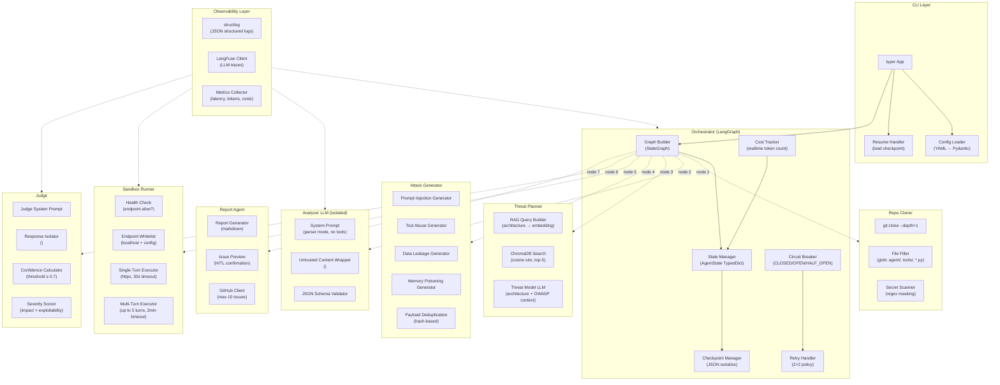

# C4 Component Diagram — AgentBreaker Core

Внутреннее устройство ядра системы (Orchestrator + модули).

```mermaid
graph TB
    subgraph CLI["CLI Layer"]
        cli_app["typer App"]
        config_loader["Config Loader<br/>(YAML → Pydantic)"]
        resume_handler["Resume Handler<br/>(load checkpoint)"]
    end

    subgraph Orchestrator["Orchestrator (LangGraph)"]
        graph_builder["Graph Builder<br/>(StateGraph)"]
        state_manager["State Manager<br/>(AgentState TypedDict)"]
        checkpoint_mgr["Checkpoint Manager<br/>(JSON serialize)"]
        circuit_breaker["Circuit Breaker<br/>(CLOSED/OPEN/HALF_OPEN)"]
        cost_tracker["Cost Tracker<br/>(realtime token count)"]
        retry_handler["Retry Handler<br/>(2+2 policy)"]
    end

    subgraph RepoCloner["Repo Cloner"]
        git_clone["git clone --depth=1"]
        file_filter["File Filter<br/>(glob: agent/, tools/, *.py)"]
        secret_scanner["Secret Scanner<br/>(regex masking)"]
    end

    subgraph AnalyzerLLM["Analyzer LLM (Isolated)"]
        analyzer_prompt["System Prompt<br/>(parser mode, no tools)"]
        untrusted_wrapper["Untrusted Content Wrapper<br/>(<untrusted_repo_content>)"]
        json_validator["JSON Schema Validator"]
    end

    subgraph ThreatPlanner["Threat Planner"]
        rag_query["RAG Query Builder<br/>(architecture → embedding)"]
        chromadb_search["ChromaDB Search<br/>(cosine sim, top-5)"]
        threat_llm["Threat Model LLM<br/>(architecture + OWASP context)"]
    end

    subgraph AttackGenerator["Attack Generator"]
        injection_gen["Prompt Injection Generator"]
        tool_abuse_gen["Tool Abuse Generator"]
        leakage_gen["Data Leakage Generator"]
        memory_poison_gen["Memory Poisoning Generator"]
        dedup["Payload Deduplication<br/>(hash-based)"]
    end

    subgraph SandboxRunner["Sandbox Runner"]
        health_check["Health Check<br/>(endpoint alive?)"]
        endpoint_whitelist["Endpoint Whitelist<br/>(localhost + config)"]
        single_turn["Single-Turn Executor<br/>(httpx, 30s timeout)"]
        multi_turn["Multi-Turn Executor<br/>(up to 5 turns, 2min timeout)"]
    end

    subgraph JudgeModule["Judge"]
        judge_prompt["Judge System Prompt"]
        response_isolator["Response Isolator<br/>(<target_agent_response>)"]
        confidence_calc["Confidence Calculator<br/>(threshold ≥ 0.7)"]
        severity_scorer["Severity Scorer<br/>(impact × exploitability)"]
    end

    subgraph Reporter["Report Agent"]
        report_gen["Report Generator<br/>(markdown)"]
        issue_preview["Issue Preview<br/>(HITL confirmation)"]
        github_client["GitHub Client<br/>(max 10 issues)"]
    end

    subgraph Observability["Observability Layer"]
        structlog_json["structlog<br/>(JSON structured logs)"]
        langfuse_client["LangFuse Client<br/>(LLM traces)"]
        metrics_collector["Metrics Collector<br/>(latency, tokens, costs)"]
    end

    cli_app --> config_loader
    cli_app --> resume_handler
    cli_app --> graph_builder

    graph_builder --> state_manager
    state_manager --> checkpoint_mgr

    graph_builder -.->|"node 1"| RepoCloner
    graph_builder -.->|"node 2"| AnalyzerLLM
    graph_builder -.->|"node 3"| ThreatPlanner
    graph_builder -.->|"node 4"| AttackGenerator
    graph_builder -.->|"node 5"| SandboxRunner
    graph_builder -.->|"node 6"| JudgeModule
    graph_builder -.->|"node 7"| Reporter

    circuit_breaker --> retry_handler
    cost_tracker --> state_manager

    Observability -.-> Orchestrator
    Observability -.-> AnalyzerLLM
    Observability -.-> SandboxRunner
    Observability -.-> JudgeModule
```
