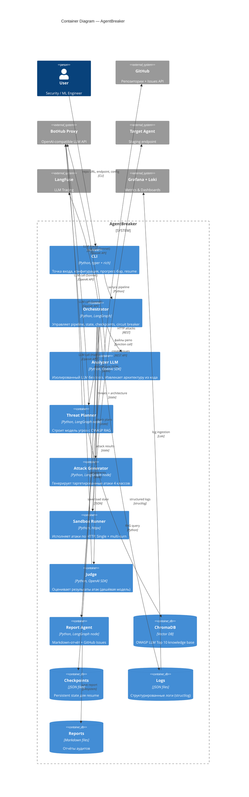

# C4 Container Diagram — AgentBreaker

Внутренние контейнеры системы, хранилища, внешние сервисы.

```mermaid
C4Container
    title Container Diagram — AgentBreaker

    Person(user, "User", "Security / ML Engineer")

    System_Boundary(ab, "AgentBreaker") {
        Container(cli, "CLI", "Python, typer + rich", "Точка входа, конфигурация, прогресс-бар, resume")
        Container(orchestrator, "Orchestrator", "Python, LangGraph", "Управляет pipeline, state, checkpoints, circuit breaker")
        Container(analyzer, "Analyzer LLM", "Python, OpenAI SDK", "Изолированный LLM без tools. Извлекает архитектуру из кода")
        Container(threat, "Threat Planner", "Python, LangGraph node", "Строит модель угроз с OWASP RAG")
        Container(attgen, "Attack Generator", "Python, LangGraph node", "Генерирует таргетированные атаки 4 классов")
        Container(runner, "Sandbox Runner", "Python, httpx", "Исполняет атаки по HTTP. Single + multi-turn")
        Container(judge, "Judge", "Python, OpenAI SDK", "Оценивает результаты атак (дешёвая модель)")
        Container(reporter, "Report Agent", "Python, LangGraph node", "Markdown-отчёт + GitHub Issues")

        ContainerDb(chromadb, "ChromaDB", "Vector DB", "OWASP LLM Top 10 knowledge base")
        ContainerDb(checkpoints, "Checkpoints", "JSON files", "Persistent state для resume")
        ContainerDb(logs, "Logs", "JSON files", "Структурированные логи (structlog)")
        ContainerDb(reports, "Reports", "Markdown files", "Отчёты аудитов")
    }

    System_Ext(github, "GitHub", "Репозитории + Issues API")
    System_Ext(bothub, "BotHub Proxy", "OpenAI-compatible LLM API")
    System_Ext(target, "Target Agent", "Staging endpoint")
    System_Ext(langfuse, "LangFuse", "LLM Tracing")
    System_Ext(grafana, "Grafana + Loki", "Metrics & Dashboards")

    Rel(user, cli, "repo URL, endpoint, config", "CLI")
    Rel(cli, orchestrator, "запуск pipeline", "Python")
    Rel(orchestrator, analyzer, "файлы репо", "function call")
    Rel(orchestrator, threat, "architecture JSON", "state")
    Rel(orchestrator, attgen, "threats + architecture", "state")
    Rel(orchestrator, runner, "attack plans", "state")
    Rel(orchestrator, judge, "attack results", "state")
    Rel(orchestrator, reporter, "judgements", "state")
    Rel(orchestrator, checkpoints, "save/load state", "JSON")

    Rel(analyzer, bothub, "LLM call (Sonnet)", "OpenAI API")
    Rel(threat, bothub, "LLM call (Sonnet)", "OpenAI API")
    Rel(threat, chromadb, "RAG query", "Python")
    Rel(attgen, bothub, "LLM call (Sonnet)", "OpenAI API")
    Rel(runner, target, "HTTP attacks", "REST")
    Rel(judge, bothub, "LLM call (Haiku)", "OpenAI API")
    Rel(reporter, github, "create Issues", "REST API")

    Rel(orchestrator, langfuse, "LLM traces", "REST")
    Rel(orchestrator, logs, "structured logs", "structlog")
    Rel(logs, grafana, "log ingestion", "Loki")
    Rel(reporter, reports, "save report", "filesystem")

    UpdateLayoutConfig($c4ShapeInRow="4", $c4BoundaryInRow="1")
```
