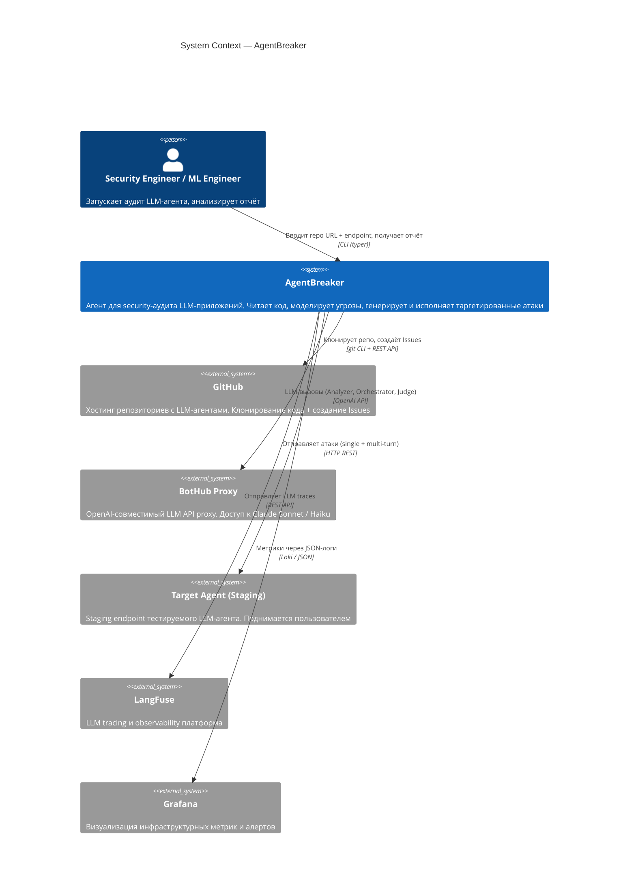
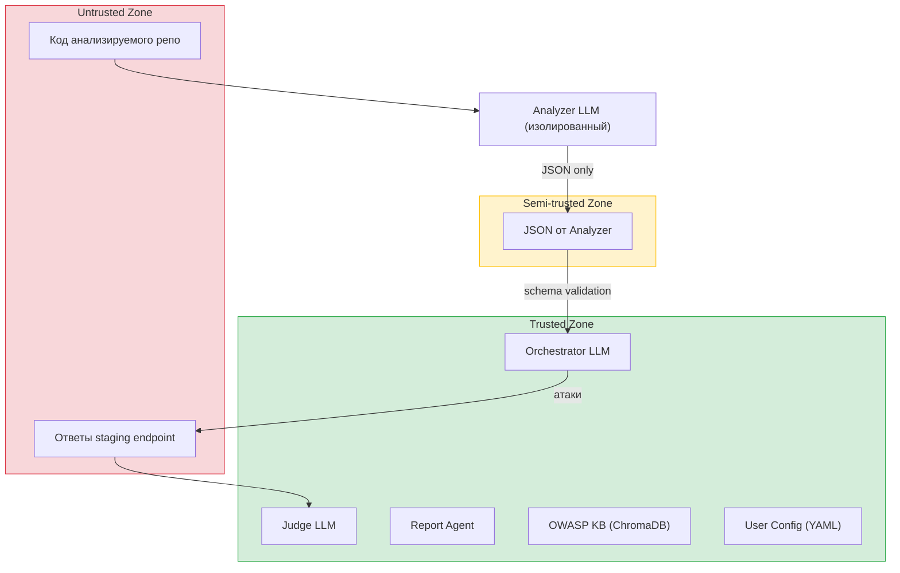

# C4 Context Diagram — AgentBreaker

Система, пользователь, внешние сервисы и границы.

```mermaid
C4Context
    title System Context — AgentBreaker

    Person(user, "Security Engineer / ML Engineer", "Запускает аудит LLM-агента, анализирует отчёт")

    System(agentbreaker, "AgentBreaker", "Агент для security-аудита LLM-приложений. Читает код, моделирует угрозы, генерирует и исполняет таргетированные атаки")

    System_Ext(github, "GitHub", "Хостинг репозиториев с LLM-агентами. Клонирование кода + создание Issues")
    System_Ext(bothub, "BotHub Proxy", "OpenAI-совместимый LLM API proxy. Доступ к Claude Sonnet / Haiku")
    System_Ext(target, "Target Agent (Staging)", "Staging endpoint тестируемого LLM-агента. Поднимается пользователем")
    System_Ext(langfuse, "LangFuse", "LLM tracing и observability платформа")
    System_Ext(grafana, "Grafana", "Визуализация инфраструктурных метрик и алертов")

    Rel(user, agentbreaker, "Вводит repo URL + endpoint, получает отчёт", "CLI (typer)")
    Rel(agentbreaker, github, "Клонирует репо, создаёт Issues", "git CLI + REST API")
    Rel(agentbreaker, bothub, "LLM-вызовы (Analyzer, Orchestrator, Judge)", "OpenAI API")
    Rel(agentbreaker, target, "Отправляет атаки (single + multi-turn)", "HTTP REST")
    Rel(agentbreaker, langfuse, "Отправляет LLM traces", "REST API")
    Rel(agentbreaker, grafana, "Метрики через JSON-логи", "Loki / JSON")

    UpdateLayoutConfig($c4ShapeInRow="3", $c4BoundaryInRow="1")
```

## Границы доверия

```mermaid
graph TB
    subgraph trusted["Trusted Zone"]
        orchestrator["Orchestrator LLM"]
        judge["Judge LLM"]
        report["Report Agent"]
        owasp["OWASP KB (ChromaDB)"]
        config["User Config (YAML)"]
    end

    subgraph semitrusted["Semi-trusted Zone"]
        analyzer_output["JSON от Analyzer"]
    end

    subgraph untrusted["Untrusted Zone"]
        repo_code["Код анализируемого репо"]
        target_responses["Ответы staging endpoint"]
    end

    repo_code -->|"<untrusted_repo_content>"| analyzer["Analyzer LLM (изолированный)"]
    analyzer -->|"JSON only"| analyzer_output
    analyzer_output -->|"schema validation"| orchestrator
    orchestrator -->|"атаки"| target_responses
    target_responses -->|"<target_agent_response>"| judge

    style trusted fill:#d4edda,stroke:#28a745
    style semitrusted fill:#fff3cd,stroke:#ffc107
    style untrusted fill:#f8d7da,stroke:#dc3545
```
