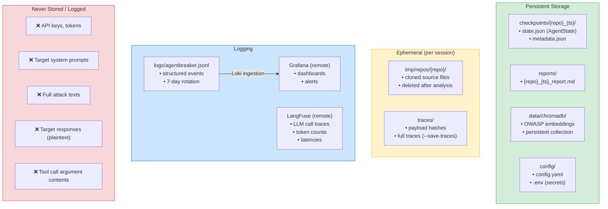

# Data Flow Diagram — AgentBreaker

Как данные проходят через систему, что хранится, что логируется.

```mermaid
flowchart LR
    subgraph Input["Input Data"]
        repo_url["repo URL"]
        endpoint["target endpoint"]
        yaml_config["config.yaml"]
    end

    subgraph Clone["Repo Cloner"]
        raw_files["Raw source files\n(≤50 files)"]
        masked_files["Masked files\n(secrets removed)"]
    end

    subgraph Analyze["Analyzer LLM"]
        untrusted_input["&lt;untrusted_repo_content&gt;\nmasked files"]
        arch_json["architecture.json\n{tools, memory_type,\nsystem_prompt_fragments,\ncall_chains}"]
    end

    subgraph Plan["Threat Planner"]
        owasp_chunks["OWASP chunks\n(top-5 cosine sim)"]
        threat_model["threat_model[]\n{class, severity,\nrelevant_tools}"]
    end

    subgraph Generate["Attack Generator"]
        attack_plans["attack_plans[]\n{id, class, payload,\ntarget_tool, turns}"]
        deduped["deduped plans\n(hash-filtered)"]
    end

    subgraph Execute["Sandbox Runner"]
        http_requests["HTTP requests\n(single + multi-turn)"]
        attack_results["attack_results[]\n{attack_id, response,\nstatus_code, latency,\nturns_log}"]
    end

    subgraph Evaluate["Judge"]
        isolated_response["&lt;target_agent_response&gt;\n(isolated context)"]
        judgements["judgements[]\n{verdict, confidence,\nseverity, explanation}"]
    end

    subgraph Output["Output"]
        report_md["report.md\n(Markdown)"]
        github_issues["GitHub Issues\n(≤10, HITL)"]
    end

    repo_url --> raw_files
    raw_files --> masked_files
    masked_files --> untrusted_input
    untrusted_input --> arch_json

    arch_json --> owasp_chunks
    arch_json --> threat_model
    threat_model --> attack_plans
    attack_plans --> deduped

    endpoint --> http_requests
    deduped --> http_requests
    http_requests --> attack_results

    attack_results --> isolated_response
    isolated_response --> judgements

    judgements --> report_md
    report_md --> github_issues
```

## Storage Map — что где хранится

## Data Transformations

| Этап | Input | Transformation | Output | Сохраняется? |
|------|-------|---------------|--------|-------------|
| Clone | repo URL | git clone --depth=1 | raw files | Ephemeral (tmp/) |
| Filter | raw files | glob + regex | ≤50 relevant files | Ephemeral |
| Mask | relevant files | regex secret scan | masked files | Ephemeral |
| Analyze | masked files | LLM (Analyzer, isolated) | architecture JSON | In state (checkpoint) |
| RAG Query | architecture JSON | embedding → cosine sim | OWASP chunks | Not stored (in-memory) |
| Plan | arch JSON + OWASP | LLM (Orchestrator) | threat_model[] | In state |
| Generate | threats + arch | LLM (Orchestrator) | attack_plans[] | In state |
| Dedup | attack_plans | hash comparison | deduped plans | In state |
| Execute | deduped plans + endpoint | httpx HTTP calls | attack_results[] | In state |
| Judge | attack_results | LLM (Judge, Haiku) | judgements[] | In state |
| Report | judgements | LLM (Orchestrator) | report.md | reports/ dir |
| Issues | report findings | GitHub API | issue URLs | In state |
