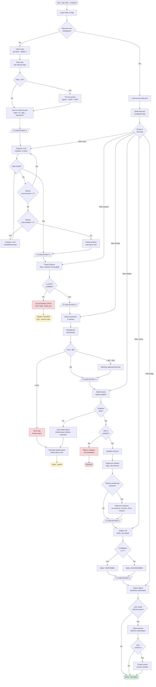

# Workflow Diagram — AgentBreaker

Пошаговое выполнение запроса, включая ветки ошибок и fallback.

```mermaid
flowchart TD
    START([User: repo URL + endpoint]) --> LOAD_CONFIG[Load YAML Config]
    LOAD_CONFIG --> CHECK_RESUME{Resume from\ncheckpoint?}

    CHECK_RESUME -->|Yes| LOAD_STATE[Load saved state.json]
    CHECK_RESUME -->|No| CLONE[Clone repo\ngit clone --depth=1]

    LOAD_STATE --> DETERMINE_STEP[Determine last\ncompleted step]
    DETERMINE_STEP --> ROUTE_RESUME{Route to\nnext step}

    CLONE --> FILTER[Filter files\n≤50 relevant files]
    FILTER --> SIZE_CHECK{Files > 50?}
    SIZE_CHECK -->|Yes| TRIM[Trim by priority\nagent/ > tools/ > other]
    SIZE_CHECK -->|No| SCAN_SECRETS
    TRIM --> SCAN_SECRETS[Scan & mask secrets\nregex: sk-, ghp_, password=]

    SCAN_SECRETS --> CHECKPOINT_1[/"☑ CHECKPOINT 1"/]
    CHECKPOINT_1 --> ANALYZER[Analyzer LLM\nIsolated, no tools]

    ANALYZER --> JSON_VALID{Valid JSON?}
    JSON_VALID -->|Yes| CHECKPOINT_2[/"☑ CHECKPOINT 2"/]
    JSON_VALID -->|No| RETRY_SAME{Retries\nsame prompt < 2?}
    RETRY_SAME -->|Yes| ANALYZER
    RETRY_SAME -->|No| RETRY_REFORM{Retries\nreformulated < 2?}
    RETRY_REFORM -->|Yes| ANALYZER_SIMPLE[Analyzer LLM\nSimplified prompt]
    RETRY_REFORM -->|No| PARTIAL_ANALYSIS[Partial analysis\nwarning to user]
    ANALYZER_SIMPLE --> JSON_VALID
    PARTIAL_ANALYSIS --> CHECKPOINT_2

    CHECKPOINT_2 --> THREAT[Threat Planner\nRAG: OWASP ChromaDB]

    THREAT --> LLM_CHECK_1{LLM API\navailable?}
    LLM_CHECK_1 -->|Yes| CHECKPOINT_3[/"☑ CHECKPOINT 3"/]
    LLM_CHECK_1 -->|No| CIRCUIT_OPEN_1[Circuit Breaker OPEN\nSave state, notify user]
    CIRCUIT_OPEN_1 --> PAUSE([Pipeline PAUSED\nUse --resume later])

    CHECKPOINT_3 --> ATTACK_GEN[Attack Generator\n4 classes]
    ATTACK_GEN --> DEDUP[Deduplicate\nhash-based]
    DEDUP --> COST_CHECK{Cost < $8?}
    COST_CHECK -->|Yes| CHECKPOINT_4[/"☑ CHECKPOINT 4"/]
    COST_CHECK -->|> $8, < $10| COST_WARN[Warning: approaching limit]
    COST_CHECK -->|≥ $10| COST_STOP[Hard stop\nPartial report]
    COST_WARN --> CHECKPOINT_4
    COST_STOP --> REPORT_PARTIAL

    CHECKPOINT_4 --> HEALTH[Health check\ntarget endpoint]
    HEALTH --> EP_ALIVE{Endpoint\nalive?}

    EP_ALIVE -->|No| PLAN_ONLY[Save attack plans\nPartial report without execution]
    EP_ALIVE -->|Yes| WHITELIST{URL in\nwhitelist?}
    PLAN_ONLY --> REPORT_PARTIAL[Generate partial report\nAttack plans only]
    REPORT_PARTIAL --> END_PARTIAL([Done - partial])

    WHITELIST -->|No| REJECT[Reject: endpoint\nnot whitelisted]
    WHITELIST -->|Yes| RUNNER[Sandbox Runner]
    REJECT --> END_REJECT([Aborted])

    RUNNER --> SINGLE[Single-turn attacks\nhttpx, 30s timeout]
    SINGLE --> MULTI{Memory poisoning\nrelevant?}
    MULTI -->|Yes| MULTI_TURN[Multi-turn sessions\n≤5 sessions, ≤5 turns, 2min timeout]
    MULTI -->|No| CHECKPOINT_5[/"☑ CHECKPOINT 5"/]
    MULTI_TURN --> CHECKPOINT_5

    CHECKPOINT_5 --> JUDGE[Judge LLM\nHaiku, per attack]
    JUDGE --> CLASSIFY{Confidence\n≥ 0.7?}
    CLASSIFY -->|Yes| CONFIRMED[Mark: CONFIRMED]
    CLASSIFY -->|No| UNCONFIRMED[Mark: UNCONFIRMED]
    CONFIRMED --> CHECKPOINT_6[/"☑ CHECKPOINT 6"/]
    UNCONFIRMED --> CHECKPOINT_6

    CHECKPOINT_6 --> REPORT[Report Agent\nMarkdown generation]
    REPORT --> ISSUES_PREVIEW{User wants\nGitHub Issues?}
    ISSUES_PREVIEW -->|Yes| HITL[Show preview\nWait for confirmation]
    ISSUES_PREVIEW -->|No| END
    HITL --> CONFIRM{User\nconfirms?}
    CONFIRM -->|Yes| CREATE_ISSUES[Create Issues\n≤10 per session]
    CONFIRM -->|No| END
    CREATE_ISSUES --> END([Done - full report])

    ROUTE_RESUME -->|After clone| ANALYZER
    ROUTE_RESUME -->|After analyze| THREAT
    ROUTE_RESUME -->|After threats| ATTACK_GEN
    ROUTE_RESUME -->|After attacks| HEALTH
    ROUTE_RESUME -->|After runner| JUDGE
    ROUTE_RESUME -->|After judge| REPORT

    style CIRCUIT_OPEN_1 fill:#f8d7da,stroke:#dc3545
    style COST_STOP fill:#f8d7da,stroke:#dc3545
    style REJECT fill:#f8d7da,stroke:#dc3545
    style PAUSE fill:#fff3cd,stroke:#ffc107
    style END fill:#d4edda,stroke:#28a745
    style END_PARTIAL fill:#fff3cd,stroke:#ffc107
    style END_REJECT fill:#f8d7da,stroke:#dc3545
```
