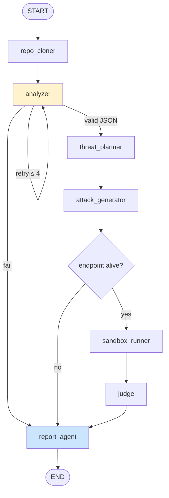

# Spec: Agent / Orchestrator

## Назначение

Orchestrator — центральный модуль на базе LangGraph StateGraph. Управляет pipeline от clone до report, контролирует state, retries, checkpoints, circuit breaker, cost tracking.

## LangGraph — граф

### Ноды

```python
from langgraph.graph import StateGraph, END

graph = StateGraph(AgentState)

graph.add_node("repo_cloner", repo_cloner_node)
graph.add_node("analyzer", analyzer_node)
graph.add_node("threat_planner", threat_planner_node)
graph.add_node("attack_generator", attack_generator_node)
graph.add_node("sandbox_runner", sandbox_runner_node)
graph.add_node("judge", judge_node)
graph.add_node("report_agent", report_agent_node)
```

### Edges и правила переходов

```python
graph.set_entry_point("repo_cloner")

graph.add_edge("repo_cloner", "analyzer")

# После analyzer — conditional: JSON валидный?
graph.add_conditional_edges("analyzer", route_after_analyzer, {
    "valid": "threat_planner",
    "retry": "analyzer",              # retry с тем же / упрощённым промптом
    "fail": "report_agent",           # partial report
})

graph.add_edge("threat_planner", "attack_generator")
graph.add_edge("attack_generator", "sandbox_runner_check")

# Проверка endpoint перед атаками
graph.add_conditional_edges("sandbox_runner_check", route_sandbox, {
    "available": "sandbox_runner",
    "unavailable": "report_agent",    # partial report (plan only)
})

graph.add_edge("sandbox_runner", "judge")

# После judge — conditional: есть findings для Issues?
graph.add_conditional_edges("judge", route_after_judge, {
    "has_findings": "report_agent",
    "no_findings": "report_agent",    # report без Issues
})

graph.add_edge("report_agent", END)
```

### Визуализация графа



## Routing Functions

### route_after_analyzer

```python
def route_after_analyzer(state: AgentState) -> str:
    if state["architecture_json"] is not None:
        return "valid"

    total_retries = state["retry_counts"].get("analyzer", 0)
    if total_retries < 2:
        # retry с тем же промптом
        return "retry"
    elif total_retries < 4:
        # retry с упрощённым промптом (reformulated)
        return "retry"
    else:
        return "fail"
```

### route_sandbox

```python
def route_sandbox(state: AgentState) -> str:
    endpoint = state["target_endpoint"]
    if not endpoint:
        return "unavailable"

    # health check
    try:
        resp = httpx.get(f"{endpoint}/health", timeout=10)
        if resp.status_code < 500:
            return "available"
    except (httpx.ConnectError, httpx.TimeoutException):
        pass

    return "unavailable"
```

## Stop Conditions

| Условие | Реакция | Результат |
|---------|---------|-----------|
| Pipeline завершён (все шаги OK) | END | Full report |
| Analyzer: 4 retry исчерпаны | → report_agent | Partial report (no attacks) |
| Endpoint недоступен | → report_agent | Partial report (plan only) |
| Circuit breaker OPEN | Save checkpoint, EXIT | Paused, resume later |
| Cost ≥ $10 | Hard stop → report_agent | Partial report with cost warning |
| Repo без LLM-кода | Early exit после Analyzer | "LLM agent not detected" message |
| User interrupt (Ctrl+C) | Save checkpoint, EXIT | Paused, resume later |

## Retry / Fallback

### Retry Policy

```python
class RetryConfig:
    max_same_prompt: int = 2           # retry с тем же промптом
    max_reformulated: int = 2          # retry с упрощённым промптом
    backoff_base: float = 2.0          # exponential backoff в секундах
    max_backoff: float = 16.0          # максимальный backoff

    def get_delay(self, attempt: int) -> float:
        return min(self.backoff_base ** attempt, self.max_backoff)
```

### Reformulation Strategy (Analyzer)

При retry с упрощённым промптом:
1. Уменьшить количество файлов (оставить только `agent/`, `main.py`)
2. Упростить system prompt: "Extract only tool names and memory type"
3. Снизить expected output: минимальный JSON schema

### Circuit Breaker

```python
class CircuitBreaker:
    state: str = "CLOSED"              # CLOSED | OPEN | HALF_OPEN
    failure_count: int = 0
    threshold: int = 3                 # failures до OPEN
    cooldown: float = 60.0             # секунд до HALF_OPEN
    last_failure_time: float = 0

    def record_success(self):
        self.failure_count = 0
        self.state = "CLOSED"

    def record_failure(self):
        self.failure_count += 1
        if self.failure_count >= self.threshold:
            self.state = "OPEN"
            self.last_failure_time = time.time()

    def can_proceed(self) -> bool:
        if self.state == "CLOSED":
            return True
        if self.state == "OPEN":
            if time.time() - self.last_failure_time > self.cooldown:
                self.state = "HALF_OPEN"
                return True  # one probe
            return False
        if self.state == "HALF_OPEN":
            return True  # probe in progress
```

## Checkpointing

```python
def save_checkpoint(state: AgentState):
    """Save state after each node completion."""
    repo_name = extract_repo_name(state["repo_url"])
    ts = datetime.now().strftime("%Y%m%d_%H%M%S")
    checkpoint_dir = f"checkpoints/{repo_name}_{ts}"

    os.makedirs(checkpoint_dir, exist_ok=True)

    # Full state
    with open(f"{checkpoint_dir}/state.json", "w") as f:
        json.dump(state, f, indent=2, default=str)

    # Lightweight metadata
    metadata = {
        "repo_url": state["repo_url"],
        "repo_name": repo_name,
        "last_completed_step": state["current_step"],
        "pipeline_status": state["pipeline_status"],
        "total_cost_usd": state["cost_tracker"]["total_cost_usd"],
        "total_tokens": state["cost_tracker"]["total_tokens"],
        "created_at": state.get("started_at"),
        "last_updated_at": datetime.now().isoformat(),
    }
    with open(f"{checkpoint_dir}/metadata.json", "w") as f:
        json.dump(metadata, f, indent=2)
```

## Cost Tracking

```python
def track_cost(state: AgentState, step: str, usage: dict, model: str):
    """Update cost tracker after each LLM call."""
    pricing = state["config"]["pricing"][model]
    input_cost = usage["prompt_tokens"] / 1_000_000 * pricing["input"]
    output_cost = usage["completion_tokens"] / 1_000_000 * pricing["output"]
    total = input_cost + output_cost

    state["cost_tracker"]["total_tokens"] += usage["total_tokens"]
    state["cost_tracker"]["total_cost_usd"] += total
    state["cost_tracker"]["by_step"][step] = {
        "tokens": usage["total_tokens"],
        "cost_usd": total,
    }

    # Check thresholds
    if state["cost_tracker"]["total_cost_usd"] >= 10.0:
        raise CostLimitExceeded("Budget exceeded $10")
    elif state["cost_tracker"]["total_cost_usd"] >= 8.0:
        logger.warning("Cost approaching limit", cost=state["cost_tracker"]["total_cost_usd"])
```

## Concurrency

PoC — **последовательное** выполнение нод. Причины:
- Проще отладка и трейсинг
- State мутации предсказуемы
- LLM API rate limits

Потенциальная оптимизация (не для PoC):
- Judge может оценивать атаки параллельно (independent calls)
- Single-turn атаки можно запускать параллельно (independent HTTP)
